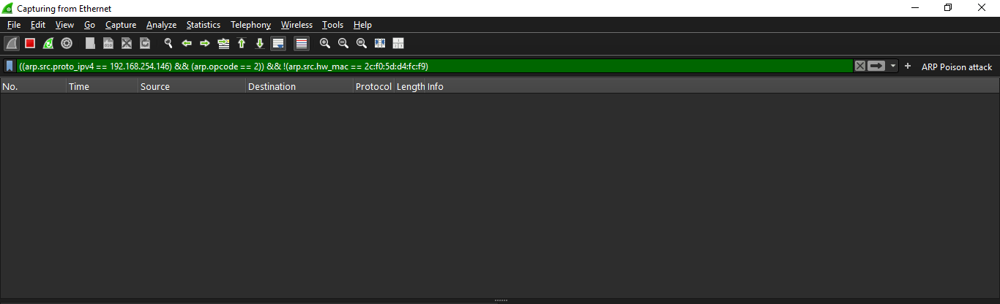
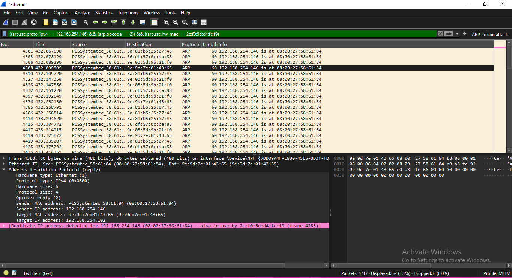

# 🔍Man-in-the-Middle-MITM-Attack-Detection-with-Wireshark
This project demonstrates how to detect a **Man-in-the-Middle (MITM)** attack using **Wireshark** and ARP poisoning analysis. It was created for internship learning purposes and showcases hands-on skills in network security monitoring and traffic analysis.

---

## 📌 Project Purpose

The main purpose of this project is to understand how MITM attacks work and how to detect them using Wireshark. By simulating a real MITM attack using Ettercap, I learned how to identify signs of ARP poisoning on the network and configure Wireshark profiles for efficient monitoring.

---

## ⚙️ Tools & Setup

- **Kali Linux (VirtualBox)** — Used to run the MITM attack with Ettercap.
- **Ettercap** — Tool for performing the MITM attack via ARP poisoning.
- **Windows 10** — The target machine for the attack.
- **Wireshark** — Used on the victim/monitoring system to detect the attack.
- **Custom Wireshark Profile** — Contains filters for detecting ARP spoofing patterns.

---

## 🧪 Project Setup

1. **Environment Configuration**:
   - Kali Linux and Windows 10 machines are on the same network.
   - Kali is running on VirtualBox with bridged or NAT adapter.
   - Windows 10 is the target of the MITM attack.

2. **MITM Attack Simulation**:
   - On Kali Linux:
     ```bash
     sudo ettercap -G
     ```
   - Targeted both gateway and Windows machine using ARP poisoning.

3. **Detection with Wireshark**:
   - Wireshark is running on the Windows machine.
   - A custom Wireshark profile named `MITM Detection` is used.
   - The filter applied:
     ```wireshark
     ((arp.src.proto_ipv4 == 192.168.254.146) && (arp.opcode == 2)) && !(arp.src.hw_mac == 2c:f0:5d:d4:fc:f9)
     ```
   - This filter helps detect ARP replies with mismatched MAC addresses.

---
## 📁 File Structure

```text
├── screenshots/
│ ├── filter-setup.png # Wireshark ARP filter setup screenshot
│ └── mitm-detected.png # Traffic showing MITM attack detected
├── README.md # Project documentation
```

---

## 📸 Screenshots

### 🖼️ Wireshark Filter Setup
> Shows the custom filter used to detect ARP poisoning.



---

### 🖼️ MITM Attack Detected
> This indicates that **two devices are claiming the same IP address** using different MAC addresses. This is a **classic sign of ARP spoofing**, which is the core technique used in a MITM attack. The attacker is impersonating a legitimate device on the network to intercept traffic between the target and the gateway.



---

## 🔍 What This Project Demonstrates

- How ARP poisoning is used in MITM attacks.
- How to use Wireshark to analyze network traffic and detect anomalies.
- How to create a reusable Wireshark profile with preloaded filters.
- How to identify suspicious ARP replies and mismatched MAC-to-IP bindings.

---

## 📚 What I Learned

- The internal workings of **Man-in-the-Middle attacks**, especially using ARP spoofing.
- How to **simulate MITM attacks** safely using Kali Linux and Ettercap.
- How to **use Wireshark profiles and display filters** for real-time network monitoring.
- How to spot abnormal ARP behavior that indicates MITM activity.
- The importance of proactive traffic analysis in **network defense**.

---


